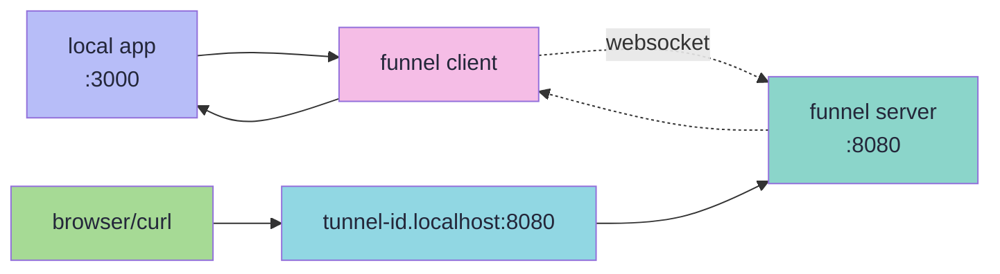

<div align="center">

# funnel

a tunneling solution built with go

expose local services to the internet through websocket connections

[documentation](https://funnel.karolbroda.com/docs) | [installation](https://funnel.karolbroda.com/docs/getting-started/installation) | [roadmap](https://funnel.karolbroda.com/docs/roadmap)

</div>

## overview

funnel creates tunnels from a public server to your local machine using websockets. when requests arrive at the server, they get proxied through to your local service. useful for development, testing, webhooks, and demos.

## quick start

```bash
curl -sSfL https://raw.githubusercontent.com/karol-broda/funnel/master/scripts/install.sh | bash
```

```bash
funnel http 3000 --server http://localhost:8080 --id my-tunnel
```

your service is now available at `http://my-tunnel.localhost:8080`.

see the [installation guide](https://funnel.karolbroda.com/docs/getting-started/installation) for more options.

## how it works



the client connects to the server via websocket and forwards http requests to your local app. the server routes requests based on subdomain (`tunnel-id.server:port`).

more in the [architecture docs](https://funnel.karolbroda.com/docs/core-concepts/architecture).

## features

http tunneling, custom tunnel ids, auto-reconnection with exponential backoff, cross-platform (linux/macos/windows, amd64/arm64), tls via let's encrypt, api key authentication, rest api for management.

## docs

- [getting started](https://funnel.karolbroda.com/docs/getting-started/installation)
- [architecture](https://funnel.karolbroda.com/docs/core-concepts/architecture)
- [client cli](https://funnel.karolbroda.com/docs/reference/client-cli)
- [server cli](https://funnel.karolbroda.com/docs/reference/server-cli)
- [server api](https://funnel.karolbroda.com/docs/reference/server-api)
- [deployment](https://funnel.karolbroda.com/docs/server/deployment)
- [security](https://funnel.karolbroda.com/docs/server/security)

## development

```bash
git clone https://github.com/karol-broda/funnel.git
cd funnel
make dev-setup
make build
make test
```

`make help` for all commands.

## contributing

fork, branch, `make dev-setup`, make changes, `make build && make test`, `make fmt && make lint`, open a pr.

## license

[mit](./LICENSE.md)
