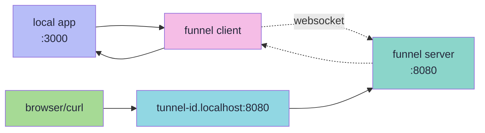

<div align="center">

# 🕳️ **funnel**

*a tunneling solution built with go*

---

**expose local services to the internet through websocket connections**

*perfect for development, testing, and demonstration purposes*

</div>

> **⚠️ disclaimer:** this tunneling solution is intended for development and testing purposes. while functional, it may not include all security features required for production environments. use at your own discretion and implement additional security measures as needed for production deployments.

## 🚀 quick start

one line install script:
```bash
curl -sSfL https://raw.githubusercontent.com/karol-broda/funnel/master/scripts/install.sh | bash
```

<details>
<summary><strong>📦 installation options</strong></summary>

the recommended way to install `funnel` is with the installer script. it automatically detects your platform, downloads the correct binary, and installs it on your system.

by default, the script installs `funnel` to `$HOME/.local/bin`. this is the recommended method as it does not require `sudo`.

the script provides several flags to customize the installation:

- **global install**: use the `--global` flag to install `funnel` to `/usr/local/bin`, making it available to all users. this requires `sudo`.
  ```bash
  curl -sSfL https://.../install.sh | bash -s -- --global
  ```

- **custom directory**: use `-b` or `--bin-dir` to specify a custom installation directory.
  ```bash
  curl -sSfL https://.../install.sh | bash -s -- -b /path/to/your/bin
  ```

- **specific version**: use `-v` to install a specific version of `funnel`.
  ```bash
  curl -sSfL https://.../install.sh | bash -s -- -v v0.0.4
  ```

- **list versions**: use `-l` to see a list of available versions.
  ```bash
  curl -sSfL https://.../install.sh | bash -s -- -l
  ```

</details>

<details>
<summary><strong>🔨 building from source</strong></summary>

```bash
git clone https://github.com/karol-broda/funnel.git
cd funnel
make dev-setup
make build
```

</details>

<details>
<summary><strong>⚡ basic usage</strong></summary>

1. **start the server:**
   ```bash
   ./bin/funnel-server
   # or: ./bin/funnel-server -port 9000
   ```

2. **connect your local service:**
   ```bash
   funnel http 3000 --server http://localhost:8080
   # or with custom id: funnel http 3000 --server http://localhost:8080 --id my-tunnel
   ```

3. **access your service:**
   ```bash
   curl http://your-tunnel-id.localhost:8080
   ```

</details>

<details>
<summary><strong>🎯 complete example</strong></summary>

```bash
# terminal 1: start a local service
python3 -m http.server 3000

# terminal 2: start funnel server  
make run-server

# terminal 3: connect funnel client
funnel http 3000 --server http://localhost:8080 --id demo

# terminal 4: test the tunnel
curl http://demo.localhost:8080
```

</details>

## 🏗️ architecture



### how it works
- **funnel client**: connects to server via websocket, forwards requests to local app
- **funnel server**: accepts websocket connections, routes external http requests to clients  
- **local app**: your application running locally (e.g., web server, api)
- requests to `tunnel-id.server:port` get routed through websocket to your local app

## 💻 usage

### server commands

```bash
# start server (default port 8080)
./bin/funnel-server

# specify custom port
./bin/funnel-server -port 9000

# show version info
./bin/funnel-server version
```

### client commands

```bash
# tunnel using port only (connects to localhost:PORT)
funnel http 3000 --server http://localhost:8080

# tunnel using full address
funnel http localhost:3000 --server http://localhost:8080
funnel http 0.0.0.0:8080 --server http://localhost:8080

# use custom tunnel id
funnel http 3000 --server http://localhost:8080 --id my-custom-tunnel

# show version info
funnel version
```

### configuration

use `funnel-server --help` and `funnel --help` for current options

## 🔧 development

<details>
<summary><strong>🔨 building</strong></summary>

```bash
# build both client and server
make build

# build individual components
make build-client
make build-server

# show available commands
make help
```

</details>

<details>
<summary><strong>🧪 testing</strong></summary>

```bash
# run all tests
make test

# verbose test output
make test-verbose

# test with coverage
make test-coverage

# test with race detection
make test-race
```

</details>

<details>
<summary><strong>📦 dependency management</strong></summary>

### quick reference
```bash
# fix go.mod files and ide errors
make tidy

# complete dependency setup (fresh install)
make deps-install

# show all modules
make list-modules
```

### when to use what
- **`make tidy`** - quick dependency cleanup, fixes ide linting errors
- **`make deps-install`** - complete setup for fresh installations, downloads everything
- use `tidy` for regular maintenance, `deps-install` for first-time setup

</details>

<details>
<summary><strong>🚀 release process</strong></summary>

```bash
# create release binaries for all platforms
make release

# platforms: linux/amd64, linux/arm64, darwin/amd64, darwin/arm64, windows/amd64
# output: dist/ directory
```

</details>

<details>
<summary><strong>🧹 maintenance</strong></summary>

```bash
# format code
make fmt

# run linter
make lint

# clean build artifacts
make clean

# show version info
make version
```

</details>

## 🔌 protocol details

### websocket communication
- client establishes websocket connection to `/ws` endpoint with tunnel id
- server creates subdomain routing (`tunnel-id.server:port`)
- http requests to subdomain are proxied through websocket to client
- client forwards requests to local app and returns responses

### tunnel id requirements
- 3-63 characters long
- lowercase letters, numbers, and hyphens only
- cannot start or end with hyphen
- auto-generated ids use domain-safe alphabet

## 🗺️ roadmap

### ✅ **what works now**

- ✅ **http tunneling** - expose local web services through websocket tunnels
- ✅ **custom tunnel ids** - use your own subdomain names or auto-generate them  
- ✅ **auto-reconnection** - clients automatically reconnect with exponential backoff
- ✅ **cross-platform support** - builds for linux, macos, windows (amd64/arm64)
- ✅ **custom domains** - works with any domain, not just localhost

### 🔄 **working on next**

- 🔄 **server api** - rest api for tunnel management and monitoring
- 🔄 **client api** - programmatic client control and configuration
- 📋 **tunnel statistics** - request counts, bandwidth usage, connection health
- 📋 **client authentication** - authenticate clients when connecting to server

### 📋 **planned improvements**

- 📋 **https by default** - automatic tls for all tunnel endpoints
- 📋 **oauth integration** - secure tunnels with tokens generated via oauth
- 📋 **tcp forwarding** - tunnel any tcp service, not just http
- 📋 **multiple tunnels per client** - run multiple services through single client
- 📋 **web dashboard** - browser-based tunnel monitoring and control

### **legend**
- ✅ **completed** - ready to use
- 🔄 **in progress** - actively being developed  
- 📋 **planned** - scheduled for development

### 🤝 contributing

contributions welcome! please:

1. fork the repository
2. create feature branch: `git checkout -b feature/your-awesome-feature`
3. set up development: `make dev-setup`
4. make changes and test: `make build && make test`
5. format and lint: `make fmt && make lint`
6. commit changes: `git commit -m "description"`
7. push and create pull request

## 📄 license

licensed under the [mit license](./LICENSE.md)